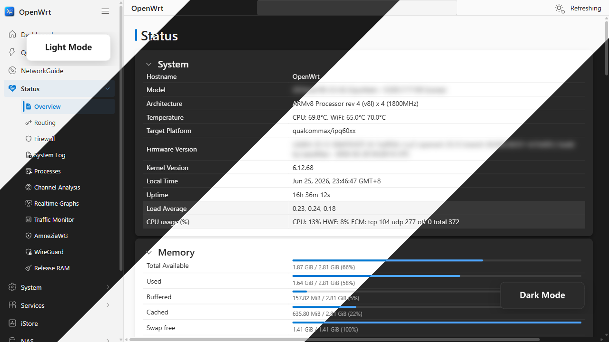
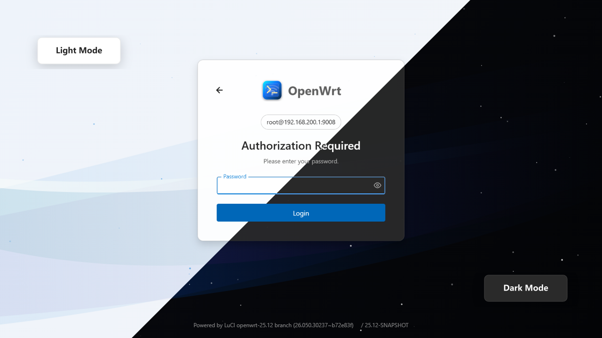
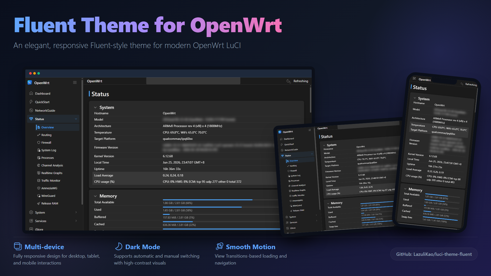
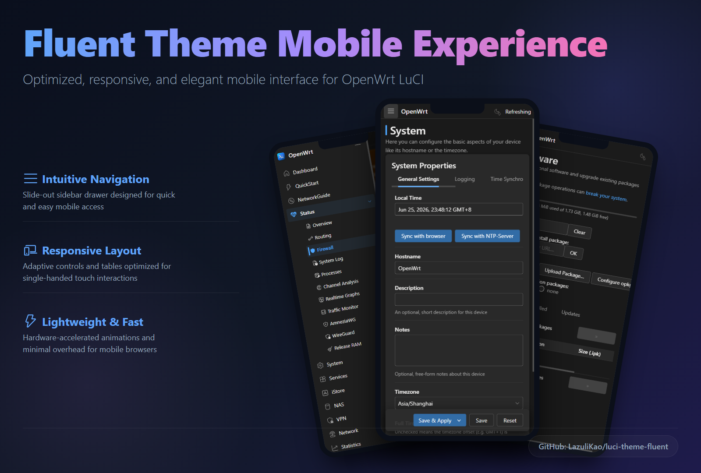

<div align="center">


# luci-theme-fluent

A FluentUI-inspired OpenWrt LuCI theme built with Rsbuild using pure TypeScript/TSX, SCSS, CSS custom properties, and ucode templates.

[](./LICENSE)
[](https://forum.openwrt.org/t/luci-theme-fluent-fluent-theme-for-openwrt/251341)
[](./package.json)
[](https://openwrt.org/)
[](https://www.google.com/chrome/)
[](https://www.apple.com/safari/)
[](https://www.mozilla.org/firefox/)
[](https://github.com/LazuliKao/luci-theme-fluent/releases)
[](https://github.com/LazuliKao/luci-theme-fluent/releases)

**English** | [简体中文](./README.zh-Hans.md)

[Features](#key-features) • [Showcase](#showcase) • [Getting Started](#getting-started) • [Configuration](#configuration) • [Build](#build) • [Project Structure](#project-structure) • [Development](#development) • [Credits](#credits)
</div>

## Showcase

<p align="center">
  
</p>

<p align="center">
  
</p>

<p align="center">
  
</p>

<p align="center">
  
</p>

## Key Features

- FluentUI-inspired visual style for LuCI.
- SCSS-based architecture with reusable partials.
- Theme tokens driven by CSS custom properties.
- ucode templates for LuCI header, footer, and login pages.
- Theme settings UI for colors, animation, and login appearance.
- Structured overrides for plugin-specific OpenWrt pages.

## Getting Started

### Install from an OpenWrt source tree

Clone this package into your OpenWrt package feed or package directory, then select it in `menuconfig`:

```bash
make menuconfig
```

Choose `LuCI -> Themes -> luci-theme-fluent`, then build your firmware or package as usual.

### Quick Install

Auto-detects `opkg` / `apk` and installs the latest release by default:

```bash
wget -qO- https://raw.githubusercontent.com/LazuliKao/luci-theme-fluent/main/install.sh | sh
```

Install the nightly build instead:

```bash
wget -qO- https://raw.githubusercontent.com/LazuliKao/luci-theme-fluent/main/install.sh | sh -s nightly
```

After installation, navigate to `System -> Fluent Theme` in the LuCI web interface.

### Manual Installation

1. Open the release page and download the package file matching your system:
   - Stable releases: https://github.com/LazuliKao/luci-theme-fluent/releases
   - Nightly release: https://github.com/LazuliKao/luci-theme-fluent/releases/tag/nightly
2. Upload the downloaded file to your router, for example into `/tmp/`.
3. Install it with the matching package manager:

```bash
# OpenWrt 24.10.x
opkg install /tmp/luci-theme-fluent_*.ipk

# OpenWrt 25.12.x
apk add --allow-untrusted /tmp/luci-theme-fluent-*.apk
```

## Configuration

The theme exposes a LuCI settings page for:

- color mode
- primary colors
- animation behavior
- login page appearance

The settings view is implemented in `src/web/resources/view/fluent-config.tsx`.

## Build

### Root scripts

```bash
pnpm install
pnpm run build
pnpm run watch
pnpm run lint
pnpm run i18n:build
```

### Source scripts

```bash
cd src
pnpm install
pnpm run build
pnpm run watch
pnpm run typecheck
```

### Output paths

- CSS: `package/luci-theme-fluent/htdocs/luci-static/fluent/css/fluent.css`
- JS: `package/luci-theme-fluent/htdocs/luci-static/resources/`

## Project Structure

```text
luci-theme-fluent/
├── package/luci-theme-fluent/htdocs/luci-static/fluent/
├── package/luci-theme-fluent/ucode/template/themes/fluent/
├── package/luci-theme-fluent/root/etc/uci-defaults/
├── package/luci-theme-fluent/Makefile
├── src/scss/
├── src/web/resources/
└── package.json
```

## Development

- `src/scss/fluent.scss` is the main Sass entry point.
- `src/scss/components/` contains reusable component styles.
- `src/scss/layouts/` contains page-level layout styles.
- `src/scss/overrides/` contains plugin-specific overrides.
- `src/web/resources/` contains the LuCI-side TypeScript/TSX code.

## Credits

- [Microsoft Fluent Design](https://developer.microsoft.com/en-us/fluentui)
- [LuCI documentation](https://openwrt.org/docs/techref/luci)
- [ucode template language](https://openwrt.org/docs/techref/utpl)
- [Apache License 2.0](./LICENSE)
