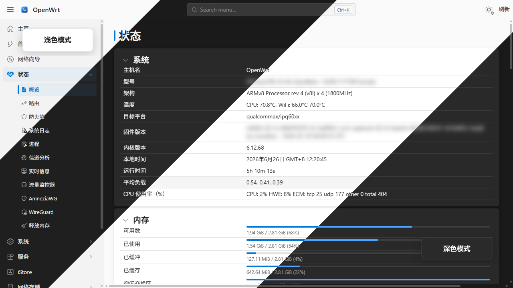
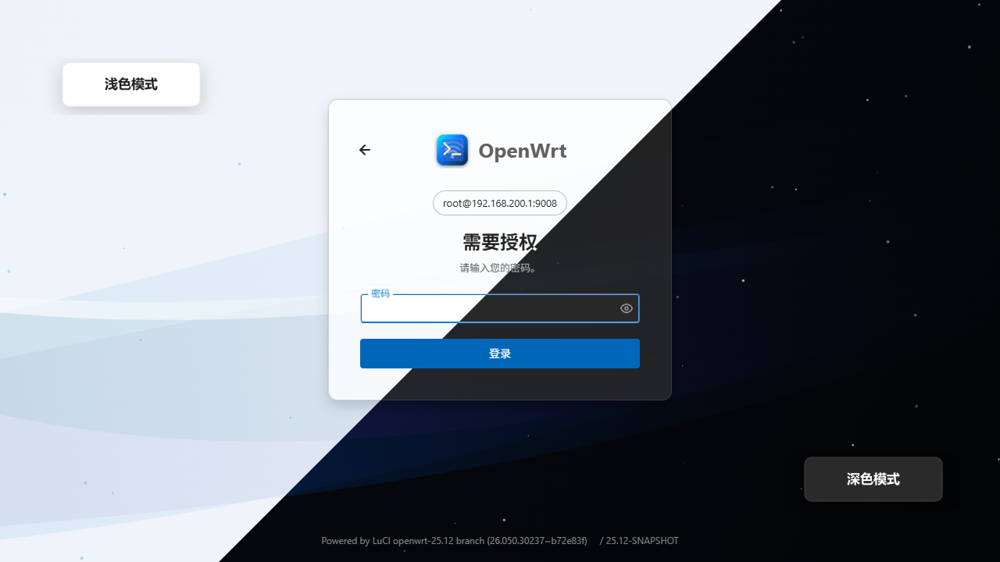
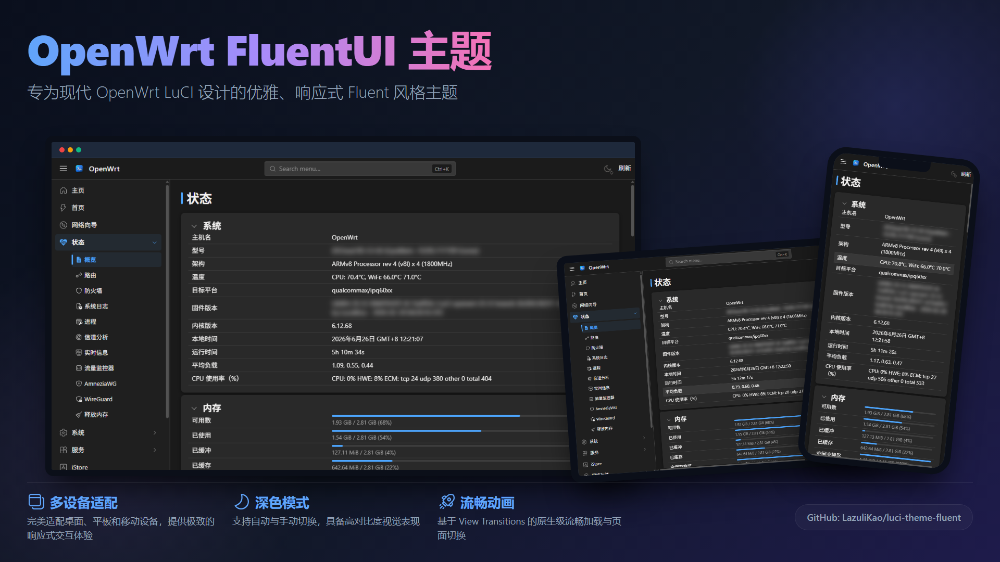
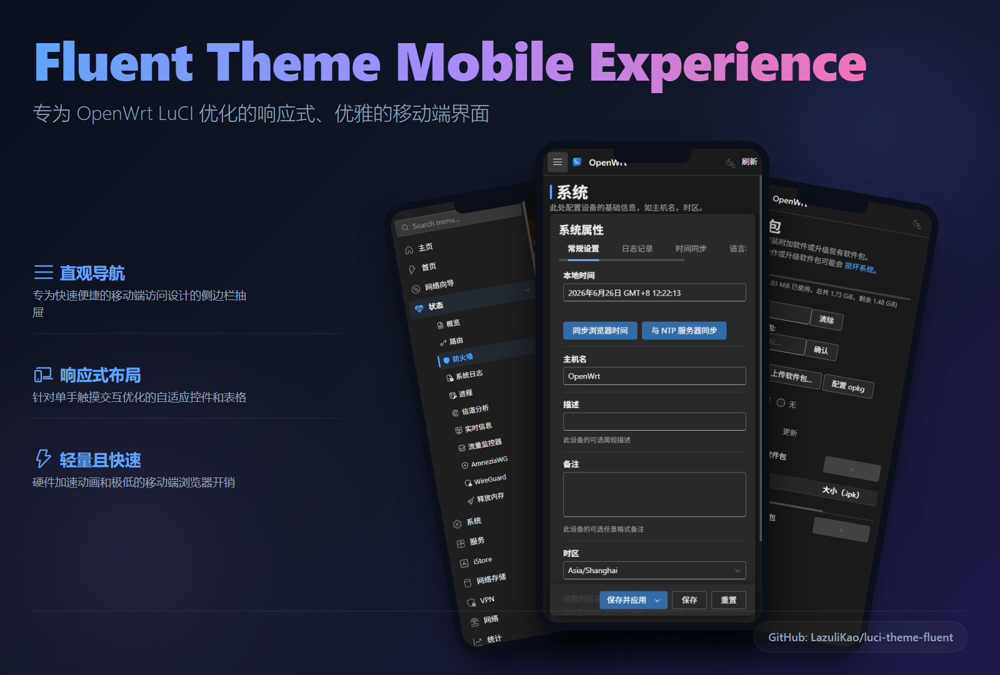

<div align="center">


# luci-theme-fluent

一款受 FluentUI 启发的 OpenWrt LuCI 主题,基于 Rsbuild,使用纯 TypeScript/TSX、SCSS、CSS 自定义属性与 ucode 模板构建。

[](./LICENSE)
[](https://forum.openwrt.org/t/luci-theme-fluent-fluent-theme-for-openwrt/251341)
[](./package.json)
[](https://openwrt.org/)
[](https://www.google.com/chrome/)
[](https://www.apple.com/safari/)
[](https://www.mozilla.org/firefox/)
[](https://github.com/LazuliKao/luci-theme-fluent/releases)
[](https://github.com/LazuliKao/luci-theme-fluent/releases)

**简体中文** | [English](./README.md)

[功能特性](#功能特性) • [界面预览](#界面预览) • [快速上手](#快速上手) • [配置](#配置) • [构建](#构建) • [项目结构](#项目结构) • [开发指南](#开发指南) • [致谢](#致谢)
</div>

## 界面预览

<p align="center">
  
</p>

<p align="center">
  
</p>

<p align="center">
  
</p>

<p align="center">
  
</p>

## 功能特性

- 为 LuCI 打造的 FluentUI 风格视觉体验。
- 基于 SCSS 的架构,组件样式模块化、可复用。
- 主题令牌由 CSS 自定义属性驱动,支持浅色/深色/自动模式。
- 使用 ucode 模板渲染 LuCI 页头、页脚与登录页。
- 提供主题设置界面,可配置颜色、动画与登录页外观。
- 针对特定插件页面提供结构化的样式覆盖。

## 快速上手

### 从 OpenWrt 源码树安装

将本仓库克隆到 OpenWrt 的 package feed 或 package 目录中,然后在 `menuconfig` 中选择:

```bash
make menuconfig
```

选择 `LuCI -> Themes -> luci-theme-fluent`,然后像往常一样构建固件或软件包即可。

### 一键安装

脚本会自动检测 `opkg` / `apk`,默认安装最新正式版:

```bash
wget -qO- https://raw.githubusercontent.com/LazuliKao/luci-theme-fluent/main/install.sh | sh
```

安装每日构建版(nightly):

```bash
wget -qO- https://raw.githubusercontent.com/LazuliKao/luci-theme-fluent/main/install.sh | sh -s nightly
```

安装完成后,在 LuCI 界面中进入 `系统 -> Fluent 主题` 即可配置。

### 手动安装

1. 打开发布页面,下载与你的系统匹配的软件包:
   - 正式版:https://github.com/LazuliKao/luci-theme-fluent/releases
   - 每日构建版:https://github.com/LazuliKao/luci-theme-fluent/releases/tag/nightly
2. 将下载的文件上传到路由器,例如 `/tmp/` 目录。
3. 使用对应的包管理器进行安装:

```bash
# OpenWrt 24.10.x
opkg install /tmp/luci-theme-fluent_*.ipk

# OpenWrt 25.12.x
apk add --allow-untrusted /tmp/luci-theme-fluent-*.apk
```

## 配置

主题提供了 LuCI 设置页面,支持配置以下内容:

- 颜色模式(浅色/深色/自动)
- 主题色
- 动画行为
- 登录页外观

设置界面实现位于 `src/web/resources/view/fluent-config.tsx`。

## 构建

### 根目录脚本

```bash
pnpm install
pnpm run build
pnpm run watch
pnpm run lint
pnpm run i18n:build
```

### 源码目录脚本

```bash
cd src
pnpm install
pnpm run build
pnpm run watch
pnpm run typecheck
```

### 输出路径

- CSS:`package/luci-theme-fluent/htdocs/luci-static/fluent/css/fluent.css`
- JS:`package/luci-theme-fluent/htdocs/luci-static/resources/`

## 项目结构

```text
luci-theme-fluent/
├── package/luci-theme-fluent/htdocs/luci-static/fluent/
├── package/luci-theme-fluent/ucode/template/themes/fluent/
├── package/luci-theme-fluent/root/etc/uci-defaults/
├── package/luci-theme-fluent/Makefile
├── src/scss/
├── src/web/resources/
└── package.json
```

## 开发指南

- `src/scss/fluent.scss` 是 Sass 的主入口文件。
- `src/scss/components/` 存放可复用的组件样式。
- `src/scss/layouts/` 存放页面级布局样式。
- `src/scss/overrides/` 存放针对特定插件的样式覆盖。
- `src/web/resources/` 存放 LuCI 侧的 TypeScript/TSX 代码。

## 致谢

- [Microsoft Fluent Design](https://developer.microsoft.com/en-us/fluentui)
- [LuCI 文档](https://openwrt.org/docs/techref/luci)
- [ucode 模板语言](https://openwrt.org/docs/techref/utpl)
- [Apache License 2.0](./LICENSE)
